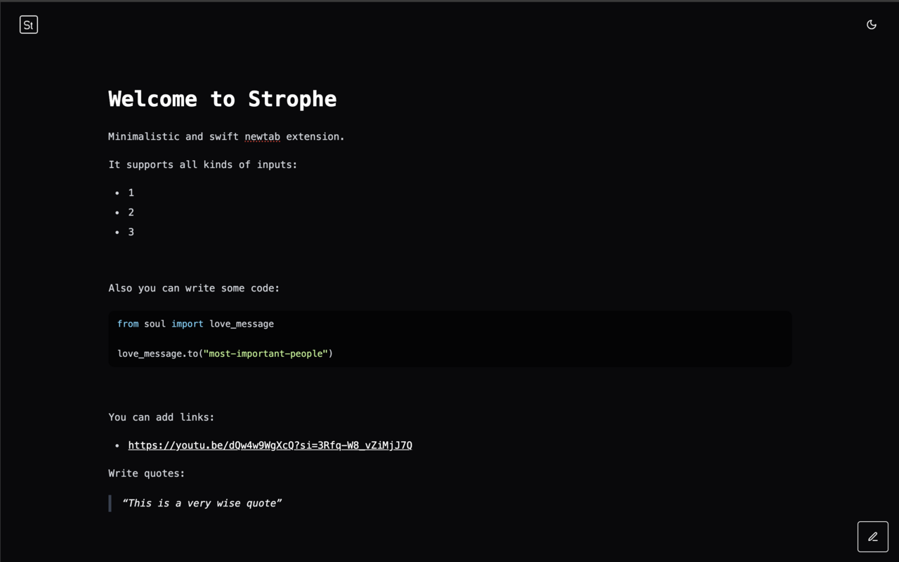

# Strophe - minimalistic newtab extension for Chrome

Strope is a simple yet functional newtab extension for Chrome.

It features nothing but a single-page note page on your default new tab, where you can write down your thoughts, ideas, or anything you want to remember.

The note is saved automatically to the local storage, so you can close the tab and come back to it later.

Note is only saved in the `local` storage. No server is involved in the process.

## Example

## Technologies used

- [Vite](https://vitejs.dev/) - build tool
- [React](https://reactjs.org/) - UI library
- [TypeScript](https://www.typescriptlang.org/) - language
- [Tailwind CSS](https://tailwindcss.com/) - CSS framework
- [shadcn/ui](https://ui.shadcn.com) - UI components
- [TipTap](https://www.tiptap.dev/) - rich text editor
- [Jotai](https://jotai.org/) - state management
